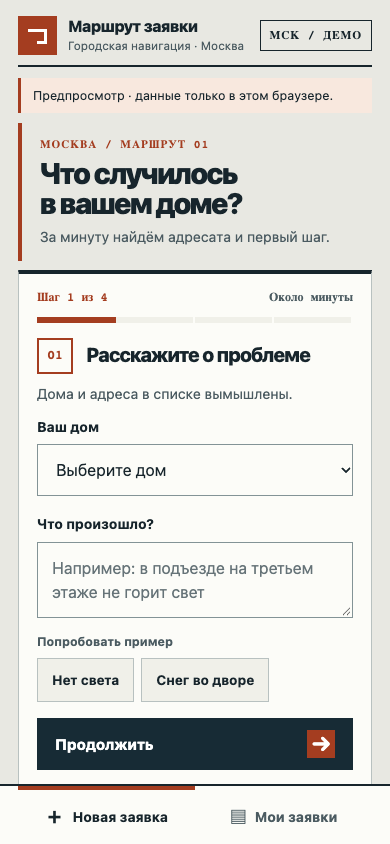

# 🧭 Маршрут заявки — мини-приложение в MAX

**Москва · ЖКХ · хакатонный MVP**

[Адрес мини-приложения для MAX](https://marshrut-zayavki-max-408.onrender.com/mini) · [Предпросмотр без MAX](https://dmksk.github.io/marshrut-zayavki-moscow/) · [](https://github.com/dmksk/marshrut-zayavki-moscow/actions/workflows/tests.yml) · [Сценарий показа](docs/DEMO.md) · [Данные и источники](docs/DATA.md) · [MIT](LICENSE)

Житель открывает мини-приложение из чата с ботом MAX, описывает проблему и проходит четыре коротких шага. ML предлагает тему, житель может её исправить. Сервис показывает **куда обращаться, что делать сейчас и что приложить**, затем создаёт демо-заявку с фото. Статус и история изменений доступны в мини-приложении; при смене статуса сервер пытается отправить сообщение через бота MAX.

> **Состояние проекта:** бот организаторов `@t408_hakaton_max_bot` подписан на webhook, Python-сервер работает на Render Free. Адрес `/mini` нужно привязать к кнопке бота в MAX. Получение настоящего сообщения и запуск мини-приложения внутри клиента MAX ещё не проверены. Все заявки учебные и не попадают в реальные службы.

**Ссылка для организаторов:** https://marshrut-zayavki-max-408.onrender.com/mini

**Проверка сервера:** https://marshrut-zayavki-max-408.onrender.com/api/health

Открытие `/mini` в обычном браузере показывает сообщение об авторизации: для работы нужна подписанная сессия запуска из MAX. Для самостоятельного просмотра интерфейса используйте [предпросмотр на GitHub Pages](https://dmksk.github.io/marshrut-zayavki-moscow/).

## Предпросмотр на GitHub

**[Открыть мини-приложение в браузере →](https://dmksk.github.io/marshrut-zayavki-moscow/)**



В этом режиме можно пройти вопросы, исправить предложенную категорию, увидеть маршрут, создать демо-заявку и переключить её демо-статус в деталях. Данные хранятся только в браузере через `localStorage`. Категорию предлагает небольшое правило по ключевым словам; серверная ML-модель, MAX Bridge, проверка подписи и уведомления бота здесь не работают. Предпросмотр не создаёт обращение в городских службах. Для полной локальной версии с ML и кабинетом диспетчера используйте инструкцию ниже.

Дизайн опирается на городскую навигацию: маршрутная линия, номера шагов, крупные заголовки и контрастные указатели. Он адаптирован под узкий экран внутри MAX и поддерживает тёмную тему.

## Сценарий жителя

```mermaid
flowchart LR
    A[Чат с ботом MAX] --> B[Кнопка «Открыть»]
    B --> C[Мини-приложение]
    C --> D[Описание → место → опасность]
    D --> E[ML предлагает тему, житель подтверждает]
    E --> F[Уточнение двора или мусора, если нужно]
    F --> J[Правила определяют маршрут]
    J --> G[Демо-заявка]
    G --> H[Мои заявки и статус]
    H --> I[Уведомление в MAX]
```



Поддержаны шесть тем: **протечка, лифт, отопление, свет в подъезде, мусор, двор**. При признаках опасности предупреждение и кнопка звонка **112** появляются ещё до завершения анкеты. Для двора и мусора задаётся дополнительный вопрос. Адреса двух демо-домов и управляющие организации вымышлены.

| Часть | Что делает |
| --- | --- |
| **Мини-приложение** | Мобильный сценарий `/mini`: четыре шага, исправление категории, маршрут с кнопкой связи, фото, список заявок и история статусов. Подключает официальный MAX Bridge. |
| **Предпросмотр GitHub Pages** | Статическая копия того же интерфейса с локальными демо-данными и имитацией API только внутри браузера. |
| **Проверка пользователя** | Сервер проверяет подпись и срок действия `window.WebApp.initData` до сообщения «подключено». Заявки выдаются только их автору в MAX. |
| **ML + правила** | TF-IDF и логистическая регрессия предлагают тему; детерминированные правила учитывают место, опасность и территорию. |
| **Бот MAX** | Показывает кнопку запуска мини-приложения после настройки URL в кабинете MAX; отправляет уведомления о статусе. Текстовый диалог остаётся запасным сценарием. |
| **Кабинет диспетчера** | Интерфейс `/admin` с ключом меняет статус `принято → назначен исполнитель → выполнено`. |

## Посмотреть локально

Нужен **Python 3.11+**. Обученная модель уже включена в репозиторий.

```bash
git clone https://github.com/dmksk/marshrut-zayavki-moscow.git
cd marshrut-zayavki-moscow
python3 -m venv .venv
source .venv/bin/activate
python -m pip install -r requirements.txt
make seed
make run
```

Откройте **http://127.0.0.1:8000/mini** — это предпросмотр мини-приложения. Выберите дом, опишите проблему, укажите место и опасность, подтвердите тему. Для двора уточните территорию; для мусора — ситуацию. На карточке маршрута можно добавить фото и создать тестовую заявку. В «Моих заявках» доступны статус и история. Предпросмотр разрешён только для сервера на `127.0.0.1` без токена бота; к аккаунту MAX заявка не привязана и сообщения бота не приходят. Для кабинета диспетчера откройте **http://127.0.0.1:8000/admin** и введите локальный ключ `hackathon-demo`. На **http://127.0.0.1:8000/** остаётся тестовое пространство с веб-формой и чат-симулятором.

Тесты API и маршрутов: `make test`. Для проверки мобильного интерфейса установите Node.js 22+, выполните `npm install`, `npx playwright install chromium` и `npm run test:e2e`. Браузерные тесты проходят серверный сценарий на ширинах 320, 375, 390 и 768 px, проверяют срочное предупреждение, исправление темы, фото, создание и смену статуса, тёмную тему и ошибку авторизации. Отдельный тест проверяет статический предпросмотр, отсутствие серверных API-вызовов и сохранение демо-заявки после перезагрузки. Скриншоты сохраняются во временный каталог; путь печатается после теста. Готовый сценарий выступления: [docs/DEMO.md](docs/DEMO.md).

## Подключить к настоящему боту MAX

Python API уже размещён на Render: [https://marshrut-zayavki-max-408.onrender.com/mini](https://marshrut-zayavki-max-408.onrender.com/mini). Токен бота и ключи сохранены в секретных переменных сервиса; в репозитории их нет. Webhook MAX подписан на `message_created` и `bot_started`. [Конфигурация Render](render.yaml) и [инструкция по эксплуатации](docs/DEPLOY_RENDER.md) позволяют восстановить сервис. GitHub Pages служит браузерным предпросмотром.

1. В настройках выданного организаторами бота `@t408_hakaton_max_bot` укажите URL `https://marshrut-zayavki-max-408.onrender.com/mini` в поле мини-приложения и выберите кнопку **«Открыть»**. По [документации MAX](https://dev.max.ru/docs/webapps/introduction) мини-приложение открывается по HTTPS внутри бота.
2. Откройте бота в MAX, нажмите **«Открыть»** и проверьте создание заявки на телефоне. После создания статус меняется в [кабинете диспетчера](https://marshrut-zayavki-max-408.onrender.com/admin) с `APP_ADMIN_KEY` из секретов Render; доставку уведомления жителю нужно проверить в MAX.

Webhook уже включён, поэтому [Long Polling](https://dev.max.ru/docs-api/methods/GET/updates) (`make max-demo`) одновременно с ним не работает. Кнопка мини-приложения задаётся отдельно в настройках бота; `MAX_MINIAPP_URL` лишь меняет текст ответа на `/start`. Сервер отправляет уведомления о смене статуса исходящим API-запросом. [Документация webhook MAX](https://dev.max.ru/docs-api/methods/POST/subscriptions).

```bash
export APP_PUBLIC=1
export MAX_BOT_TOKEN='токен_бота'
export MAX_MINIAPP_URL='https://ваш-домен/mini'
export APP_ADMIN_KEY='длинный_случайный_ключ'
make run
```

`APP_PUBLIC=1` закрывает старые общие методы заявок ключом диспетчера. Мини-приложение использует отдельные методы с проверкой подписи MAX и привязкой к пользователю. Для HTTPS API MAX клиент использует [открытый корневой сертификат Минцифры](certs/README.md) только в собственном TLS-контексте; проверка сертификата остаётся включённой. При необходимости задайте `MAX_CA_BUNDLE`.

## Московский маршрут

- Для проблем дома и общего имущества первый канал — **Единый диспетчерский центр Москвы**, **+7 (495) 539-53-53**. Источники: [правила «Вызова мастера»](https://www.mos.ru/assets/vyzov-mastera/static/documents/rules.pdf) и [городская справка](https://parking.mos.ru/extra/antiterror/).
- Для подтверждённой городской территории предлагается портал [«Наш город»](https://gorod.mos.ru/). Контекст сервиса есть в [докладе Москвы](https://www.mos.ru/upload/documents/files/8634/DokladMoskvaza2020god%28ytverjdennii%29.pdf).
- При застревании в лифте, дыме, искрении или воде возле электрооборудования показываются срочные действия и **112**.

Проект не определяет конкретную ресурсоснабжающую организацию без договорных данных дома. Срок ответа сообщает официальный канал после регистрации; сроки и статусы в приложении **демонстрационные**. Заявка никуда из локальной базы не передаётся.

## Данные и модель

[`data/requests_6000.jsonl`](data/requests_6000.jsonl) содержит **6 000 уникальных синтетических запросов** — по 1 000 на каждую тему. Тексты созданы нами по тематике открытых московских материалов; **это не опубликованные реальные обращения жителей**. У строк есть признаки `origin: "synthetic_from_public_moscow_guides"` и `is_real_resident_message: false`.

Классификатор: TF-IDF по словам и символам + логистическая регрессия. На отложенных синтетических группах фраз получено **macro-F1 0,9372** на 705 примерах. Это не оценка точности на реальных обращениях или правильности маршрута. Источники и методика: [docs/DATA.md](docs/DATA.md).

```bash
make data    # воспроизвести синтетический набор
make train   # переобучить модель
make test    # запустить проверки
```

## Структура

| Путь | Содержимое |
| --- | --- |
| [`web/mini.html`](web/mini.html), [`web/mini.css`](web/mini.css), [`web/mini.js`](web/mini.js) | Мобильное мини-приложение MAX |
| [`index.html`](index.html), [`preview/mock-api.js`](preview/mock-api.js) | Предпросмотр для GitHub Pages; `index.html` генерируется из `web/mini.html` командой `python3 scripts/build_pages_preview.py` |
| [`app/max_webapp.py`](app/max_webapp.py) | Проверка подписи и срока действия данных запуска |
| [`app/server.py`](app/server.py) | API мини-приложения, заявок и кабинета |
| [`app/max_bot.py`](app/max_bot.py) | Бот, уведомления и запасной текстовый диалог |
| [`data/`](data/) | Демо-дома, 6 000 примеров, модель и метрики |
| [`docs/DEMO.md`](docs/DEMO.md) | Сценарий показа |
| [`tests/mini_e2e.cjs`](tests/mini_e2e.cjs) | Сквозная проверка интерфейса и ключевых состояний |

## API мини-приложения

- `GET /api/houses` — демо-дома.
- `POST /api/triage` — тема, уточнения и маршрут.
- `GET /api/max/mini/session` — серверное подтверждение запуска или локального предпросмотра.
- `POST /api/max/mini/tickets` — новая заявка, заголовок `X-Max-Init-Data`.
- `GET /api/max/mini/tickets` — заявки текущего пользователя MAX.
- `GET /api/max/mini/tickets/{id}` — конкретная своя заявка.

Сервер сверяет [подпись `initData` по алгоритму MAX](https://dev.max.ru/docs/webapps/validation), проверяет время запуска и берёт ID пользователя только из проверенных данных. `initDataUnsafe` для авторизации не используется. Для создания заявки сервер дополнительно требует ответы о месте и опасности, подтверждённую категорию и нужное уточнение; одного клиентского шага недостаточно для обхода проверки.

## Границы MVP

Для подтверждения конечного пути нужно привязать URL к кнопке бота и проверить сценарий внутри клиента MAX. Для пилота также понадобятся договорённость с исполнителем, постоянное хранилище, реальные размеченные обращения, политика хранения фото и контроль доставки уведомлений. Метрики пилота: время до корректной заявки, доля без переадресации, доля завершивших сценарий и повторные обращения.

Код — [MIT](LICENSE). Городские документы остаются на официальных сайтах; здесь только ссылки и собственные синтетические тексты.
