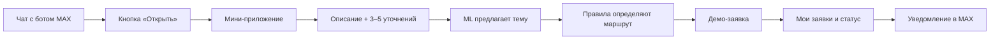

# 🧭 Маршрут заявки — мини-приложение в MAX

**Москва · ЖКХ · хакатонный MVP**

[](https://github.com/dmksk/marshrut-zayavki-moscow/actions/workflows/tests.yml) · [Сценарий показа](docs/DEMO.md) · [Данные и источники](docs/DATA.md) · [MIT](LICENSE)

Житель открывает мини-приложение из чата с ботом MAX, описывает проблему дома и отвечает на короткие вопросы. Сервис показывает **куда обращаться, что делать сейчас и что приложить**, затем создаёт демо-заявку. Статус виден в мини-приложении, а при его изменении бот присылает сообщение.

> **Состояние проекта:** мини-приложение, серверная проверка запуска MAX и сценарий уведомлений реализованы и проверены локально. Публичного бота и HTTPS-адреса пока нет, поэтому живой запуск внутри MAX не заявляется. Локальный предпросмотр доступен без аккаунта.

## Сценарий жителя



Поддержаны шесть тем: **протечка, лифт, отопление, свет в подъезде, мусор, двор**. При угрозе людям сервис показывает срочные действия и **112**. Если принадлежность территории неясна, сначала просит уточнение. Адреса двух демо-домов и управляющие организации вымышлены.

| Часть | Что делает |
| --- | --- |
| **Мини-приложение** | Мобильный экран `/mini`: заявка с фото, карточка маршрута, список своих заявок. Подключает официальный MAX Bridge. |
| **Проверка пользователя** | Сервер проверяет подпись и срок действия `window.WebApp.initData`. Заявки выдаются только их автору в MAX. |
| **ML + правила** | TF-IDF и логистическая регрессия предлагают тему; детерминированные правила учитывают место, опасность и территорию. |
| **Бот MAX** | Показывает кнопку запуска мини-приложения после настройки URL в кабинете MAX; отправляет уведомления о статусе. Текстовый диалог остаётся запасным сценарием. |
| **Кабинет диспетчера** | Локальный интерфейс `/admin` меняет статус `принято → назначен исполнитель → выполнено`. |

## Посмотреть локально

Нужен **Python 3.11+**. Обученная модель уже включена в репозиторий.

```bash
git clone https://github.com/dmksk/marshrut-zayavki-moscow.git
cd marshrut-zayavki-moscow
python3 -m venv .venv
source .venv/bin/activate
python -m pip install -r requirements.txt
make seed
make run
```

Откройте **http://127.0.0.1:8000/mini** — это предпросмотр мини-приложения. Можно пройти весь сценарий, создать локальную тестовую заявку и увидеть её в «Мои заявки». Такой предпросмотр разрешён только для сервера на `127.0.0.1` без токена бота; к аккаунту MAX заявка не привязана. Для кабинета диспетчера откройте **http://127.0.0.1:8000/admin** и введите локальный ключ `hackathon-demo`. На **http://127.0.0.1:8000/** остаётся тестовое пространство с веб-формой и чат-симулятором.

Тесты: `make test`. Готовый трёхминутный сценарий: [docs/DEMO.md](docs/DEMO.md).

## Подключить к настоящему боту MAX

1. Создайте бота в [MAX для партнёров](https://business.max.ru/) по [официальной инструкции](https://dev.max.ru/docs/chatbots/bots-create/create). Нужен верифицированный профиль организации, ИП или самозанятого; бот проходит модерацию.
2. Разместите этот сервер за публичным **HTTPS** с постоянным адресом. Задайте `MAX_BOT_TOKEN`, длинный случайный `APP_ADMIN_KEY` и `APP_PUBLIC=1`. Сервер может слушать `127.0.0.1:8000` за TLS-прокси. Данные запуска и токен не коммитьте.
3. В настройках бота укажите URL `https://ваш-домен/mini` в поле мини-приложения и выберите кнопку **«Открыть»**. MAX добавит кнопку запуска в чат. По [документации MAX](https://dev.max.ru/docs/webapps/introduction) мини-приложение должно открываться по HTTPS внутри бота.
4. Откройте бота в MAX, нажмите **«Открыть»**. После создания заявки её статус меняется в локальном кабинете `/admin` с ключом диспетчера; бот отправляет уведомление жителю.

Для работы мини-приложения webhook не обязателен: его кнопка задаётся в настройках бота, а уведомления отправляются исходящим API-запросом. Чтобы бот отвечал и на сообщения, включите один из режимов: [webhook](https://dev.max.ru/docs-api/methods/POST/subscriptions) для постоянного сервера или `make max-demo` с [Long Polling](https://dev.max.ru/docs-api/methods/GET/updates) для локальной разработки. Одновременно они не работают. Если задан `MAX_MINIAPP_URL`, бот в ответе на `/start` подскажет открыть мини-приложение. Сам URL всё равно нужно привязать к боту в настройках MAX.

```bash
export APP_PUBLIC=1
export MAX_BOT_TOKEN='токен_бота'
export MAX_MINIAPP_URL='https://ваш-домен/mini'
export APP_ADMIN_KEY='длинный_случайный_ключ'
make run
```

`APP_PUBLIC=1` закрывает старые общие методы заявок ключом диспетчера. Мини-приложение использует отдельные методы с проверкой подписи MAX и привязкой к пользователю. Для HTTPS API MAX клиент использует [открытый корневой сертификат Минцифры](certs/README.md) только в собственном TLS-контексте; проверка сертификата остаётся включённой. При необходимости задайте `MAX_CA_BUNDLE`.

## Московский маршрут

- Для проблем дома и общего имущества первый канал — **Единый диспетчерский центр Москвы**, **+7 (495) 539-53-53**. Источники: [правила «Вызова мастера»](https://www.mos.ru/assets/vyzov-mastera/static/documents/rules.pdf) и [городская справка](https://parking.mos.ru/extra/antiterror/).
- Для подтверждённой городской территории предлагается портал [«Наш город»](https://gorod.mos.ru/). Контекст сервиса есть в [докладе Москвы](https://www.mos.ru/upload/documents/files/8634/DokladMoskvaza2020god%28ytverjdennii%29.pdf).
- При застревании в лифте, дыме, искрении или воде возле электрооборудования показываются срочные действия и **112**.

Проект не определяет конкретную ресурсоснабжающую организацию без договорных данных дома. Срок ответа сообщает официальный канал после регистрации; сроки и статусы в приложении **демонстрационные**. Заявка никуда из локальной базы не передаётся.

## Данные и модель

[`data/requests_6000.jsonl`](data/requests_6000.jsonl) содержит **6 000 уникальных синтетических запросов** — по 1 000 на каждую тему. Тексты созданы нами по тематике открытых московских материалов; **это не опубликованные реальные обращения жителей**. У строк есть признаки `origin: "synthetic_from_public_moscow_guides"` и `is_real_resident_message: false`.

Классификатор: TF-IDF по словам и символам + логистическая регрессия. На отложенных синтетических группах фраз получено **macro-F1 0,9372** на 705 примерах. Это не оценка точности на реальных обращениях или правильности маршрута. Источники и методика: [docs/DATA.md](docs/DATA.md).

```bash
make data    # воспроизвести синтетический набор
make train   # переобучить модель
make test    # запустить проверки
```

## Структура

| Путь | Содержимое |
| --- | --- |
| [`web/mini.html`](web/mini.html) | Мобильное мини-приложение MAX |
| [`app/max_webapp.py`](app/max_webapp.py) | Проверка подписи и срока действия данных запуска |
| [`app/server.py`](app/server.py) | API мини-приложения, заявок и кабинета |
| [`app/max_bot.py`](app/max_bot.py) | Бот, уведомления и запасной текстовый диалог |
| [`data/`](data/) | Демо-дома, 6 000 примеров, модель и метрики |
| [`docs/DEMO.md`](docs/DEMO.md) | Сценарий показа |

## API мини-приложения

- `GET /api/houses` — демо-дома.
- `POST /api/triage` — тема, уточнения и маршрут.
- `POST /api/max/mini/tickets` — новая заявка, заголовок `X-Max-Init-Data`.
- `GET /api/max/mini/tickets` — заявки текущего пользователя MAX.
- `GET /api/max/mini/tickets/{id}` — конкретная своя заявка.

Сервер сверяет [подпись `initData` по алгоритму MAX](https://dev.max.ru/docs/webapps/validation), проверяет время запуска и берёт ID пользователя только из проверенных данных. `initDataUnsafe` для авторизации не используется.

## Границы MVP

Нужны реальный бот, HTTPS-хостинг и проверка внутри клиента MAX, чтобы подтвердить конечный пользовательский путь. Для пилота также понадобятся договорённость с исполнителем, реальные размеченные обращения, политика хранения фото и контроль доставки уведомлений. Метрики пилота: время до корректной заявки, доля без переадресации, доля завершивших сценарий и повторные обращения.

Код — [MIT](LICENSE). Городские документы остаются на официальных сайтах; здесь только ссылки и собственные синтетические тексты.
