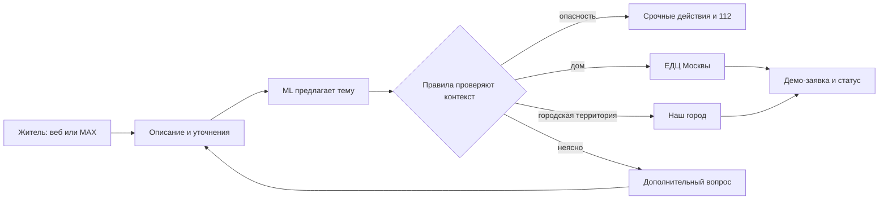

# 🧭 Маршрут заявки

**Москва · ЖКХ · хакатонный MVP · сценарий для MAX**

[](https://github.com/dmksk/marshrut-zayavki-moscow/actions/workflows/tests.yml) · [Демо за 3 минуты](docs/DEMO.md) · [О данных](docs/DATA.md) · [MIT](LICENSE)

> «В подъезде течёт труба». Куда писать и что делать прямо сейчас? Житель описывает проблему, отвечает на короткие уточнения и получает маршрут обращения. Затем создаёт демо-заявку и видит её статус.

Проект объединяет веб-интерфейс жителя, кабинет диспетчера, ML-подсказку темы и локальный симулятор бота MAX. Демо работает без подключения к городским системам.

> **Важно о данных:** 6 000 запросов в репозитории — **синтетические** формулировки по тематике открытых московских материалов. Это не реальные жалобы жителей. Оценка модели на этих текстах не показывает её точность на реальном потоке.

## Демо за 3 минуты

1. Запустите приложение и откройте **http://127.0.0.1:8000**.
2. Во вкладке **Жителю** выберите демо-дом и введите: **«В подъезде не горит свет»**. Ответьте на уточнения, посмотрите карточку маршрута и создайте заявку.
3. Во вкладке **Диспетчеру** введите демо-ключ `hackathon-demo`. Переведите заявку из **«принято»** в **«назначен исполнитель»**, затем в **«выполнено»**. Статус обновится у жителя.
4. Во вкладке **Бот MAX** отправьте `/start`: симулятор проведёт похожий сценарий в формате чата и создаст заявку в той же базе.

Готовый сценарий выступления, включая аварийный и неоднозначный кейсы: [docs/DEMO.md](docs/DEMO.md).

## Быстрый запуск

Нужен **Python 3.11+**. Обученная модель уже включена в репозиторий.

```bash
git clone https://github.com/dmksk/marshrut-zayavki-moscow.git
cd marshrut-zayavki-moscow
python3 -m venv .venv
source .venv/bin/activate
python -m pip install -r requirements.txt
make seed
make run
```

Откройте **http://127.0.0.1:8000**. Проверки: `make test`. Если `make` недоступен, выполните `python3 scripts/seed_demo.py` и `APP_ADMIN_KEY=hackathon-demo python3 -m app.server`.

`hackathon-demo` — ключ только для локального показа. Для своего запуска задайте другой `APP_ADMIN_KEY` через переменную окружения.

## Как это работает

| Шаг | Результат |
| --- | --- |
| **Описание** | ML предлагает одну из шести тем: протечка, лифт, отопление, свет в подъезде, мусор, двор. |
| **Уточнения** | Вопросы помогают определить место, принадлежность территории и признаки опасности. |
| **Маршрут** | Правила подсказывают первый канал, срочные действия и данные для обращения. Опасные случаи обрабатываются независимо от ML. |
| **Заявка** | SQLite хранит описание, фото, историю и статусы `accepted → assigned → done`. |
| **MAX** | Есть локальный чат-симулятор и код HTTPS webhook для настоящего бота при наличии токена и публичного адреса. |



### Московский маршрут

- Для проблем дома и общего имущества начальный канал — **Единый диспетчерский центр Москвы**, **+7 (495) 539-53-53**. См. [правила «Вызова мастера»](https://www.mos.ru/assets/vyzov-mastera/static/documents/rules.pdf) и [городской источник телефона](https://parking.mos.ru/extra/antiterror/).
- Для подтверждённой городской территории предлагается портал [«Наш город»](https://gorod.mos.ru/). Назначение канала описано в [докладе Москвы](https://www.mos.ru/upload/documents/files/8634/DokladMoskvaza2020god%28ytverjdennii%29.pdf).
- Если человек застрял в лифте, есть дым, искрение или вода возле электрооборудования, приложение показывает срочные действия и **112**. Если принадлежность двора неизвестна, просит уточнение.

Демо-дома и УК/ТСЖ вымышлены. Проект не угадывает конкретную ресурсоснабжающую организацию без адресных договорных данных. Срок реакции сообщает официальный канал после регистрации; статусы и время их смены здесь **демонстрационные**, а не нормативный SLA.

## Датасет и модель

[`data/requests_6000.jsonl`](data/requests_6000.jsonl) содержит **6 000 уникальных синтетических запросов**: по 1 000 для каждой из шести тем. У строк есть `city: "Москва"`, `origin: "synthetic_from_public_moscow_guides"`, `is_real_resident_message: false`, класс и разбиение на обучение/проверку.

Классификатор — TF-IDF по словам и символам + логистическая регрессия. На отложенных **синтетических** группах фраз: **macro-F1 0,9372** на 705 примерах. Это внутренняя оценка классификатора, **не показатель точности маршрута на реальных обращениях**.

```bash
make data    # воспроизвести синтетический набор
make train   # переобучить модель и обновить метрики
make test    # запустить тесты
```

Открытые источники, методика и план перехода к реальным данным: [docs/DATA.md](docs/DATA.md).

## Структура проекта

| Путь | Что внутри |
| --- | --- |
| [`app/`](app/) | Сервер, маршрутизация, заявки и адаптер MAX |
| [`web/`](web/) | Интерфейс жителя, диспетчера и симулятора |
| [`data/`](data/) | Демо-дома, датасет, модель и метрики |
| [`scripts/`](scripts/) | Генерация данных, обучение, подготовка демо |
| [`tests/`](tests/) | Проверки данных, сценариев и API |
| [`docs/`](docs/) | Сценарий показа и методика данных |

<details>
<summary><strong>HTTP API и пример запроса</strong></summary>

Сервер по умолчанию слушает `127.0.0.1:8000`. JSON-ответы в UTF-8.

| Метод | Путь | Назначение |
| --- | --- | --- |
| `GET` | `/api/health` | Проверка сервиса |
| `GET` | `/api/houses` | Демо-дома |
| `POST` | `/api/triage` | Тема, уточнения и маршрут |
| `POST` | `/api/tickets` | Создать демо-заявку |
| `GET` | `/api/tickets` | Очередь диспетчера |
| `GET` | `/api/tickets/{id}` | Статус и история |
| `PATCH` | `/api/tickets/{id}/status` | Следующий статус; заголовок `X-Admin-Key` |
| `POST` | `/api/demo/max` | Локальный симулятор MAX |
| `POST` | `/webhook/max` | Webhook MAX при наличии токена и секрета |

```bash
curl -s http://127.0.0.1:8000/api/triage \
  -H 'Content-Type: application/json' \
  -d '{"house_id":"demo_1","text":"В подъезде не горит свет","answers":{"location":"подъезд","danger":"нет"}}'
```

</details>

<details>
<summary><strong>Как подключить настоящего бота MAX</strong></summary>

Локальный симулятор работает без токена. Для настоящего бота нужны аккаунт с доступом к созданию бота, `MAX_BOT_TOKEN`, `MAX_WEBHOOK_SECRET` и публичный HTTPS-адрес. Условия доступа описаны в [официальной документации MAX](https://dev.max.ru/docs/chatbots/bots-coding/prepare).

1. Передайте токен, секрет webhook и длинный `APP_ADMIN_KEY` через переменные окружения. Не коммитьте `.env`.
2. Разместите сервер за TLS-прокси по адресу вида `https://example.ru/webhook/max`.
3. Подпишите бота на `message_created` и `bot_started` через [`POST /subscriptions`](https://dev.max.ru/docs-api/methods/POST/subscriptions). Базовый URL и заголовки сверяйте с [API MAX](https://dev.max.ru/docs-api).

```bash
curl -X POST 'https://platform-api2.max.ru/subscriptions' \
  -H "Authorization: $MAX_BOT_TOKEN" \
  -H 'Content-Type: application/json' \
  -d "{\"url\":\"https://example.ru/webhook/max\",\"update_types\":[\"message_created\",\"bot_started\"],\"secret\":\"$MAX_WEBHOOK_SECRET\"}"
```

Уведомления MAX отправляются только для заявок, созданных через настоящего бота с токеном. В симуляторе статус доступен через `/status НОМЕР` и веб-интерфейс.

</details>

## Границы MVP и следующий шаг

Заявки и статусы сейчас живут **только в локальной демо-базе**. Проект не подключён к ЕДЦ, ГИС ЖКХ, УК или «Нашему городу» и не отправляет им обращения. Фото из MAX в демо фиксируется как токен вложения без загрузки бинарного файла.

Для пилота нужны согласованная выборка реальных сообщений, независимая разметка, интеграция со службой-исполнителем, авторизация, защита фото и контроль доставки уведомлений. Пилотные метрики: **время до правильной заявки**, **доля без переадресации**, **доля завершивших сценарий**, **повторные обращения**.

Код — [MIT](LICENSE). Городские документы остаются на официальных сайтах; в репозитории только ссылки и собственные синтетические тексты.
