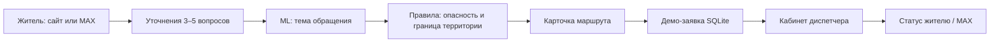

# Маршрут заявки · Москва

**Хакатонный MVP:** житель описывает проблему в доме или дворе, модель предлагает тему, короткие вопросы уточняют ситуацию, а правила выдают маршрут обращения. После подтверждения появляется демо-заявка с номером, фото и цепочкой статусов. Есть интерфейс диспетчера и бот MAX с локальным симулятором.

> **Про данные:** 6 000 строк в репозитории — синтетические русские формулировки, созданные по открытым московским материалам. Это не выгрузка 6 000 реальных жалоб жителей. Метрика модели на этих фразах не равна точности в городе.

## Запуск за минуту

Требуется Python 3.11+.

```bash
python3 -m venv .venv
source .venv/bin/activate
python -m pip install -r requirements.txt
make seed
make run
```

Откройте **http://127.0.0.1:8000**. В кабинете диспетчера ключ по умолчанию для `make run`: `hackathon-demo`. Для своего ключа: `APP_ADMIN_KEY=длинный-случайный-ключ make run`. `make test` запускает проверки. Если `make` нет, запустите `APP_ADMIN_KEY=hackathon-demo python3 -m app.server`.

### Что показать жюри

1. Во вкладке **Жителю** введите «В подъезде не горит свет», выберите дом и место. Получите карточку московского ЕДЦ и создайте заявку.
2. Во вкладке **Диспетчеру** переведите её из «принято» в «назначен исполнитель», затем в «выполнено». Вернитесь к жителю — статус обновится.
3. Во вкладке **Бот MAX** напишите `/start`, выберите дом `1`, опишите проблему и ответьте на вопросы. Симулятор создаст заявку в той же базе.

Готовый сценарий выступления: [docs/DEMO.md](docs/DEMO.md).

## Что внутри

| Компонент | Реализация |
| --- | --- |
| Классификация | `TF-IDF` по словам и символам + логистическая регрессия, обученная на 6 000 синтетических строках |
| Маршрутизация | Правила поверх ML: ЕДЦ по дому, «Наш город» для подтверждённой городской территории, уточнение при неопределённости |
| Безопасность | Отдельные правила для человека в лифте, дыма, искрения и воды у электрооборудования; совет `112` не зависит от ML |
| Заявки | SQLite, фото PNG/JPEG до 3 МБ, история событий и переходы `accepted → assigned → done` |
| MAX | HTTPS webhook с проверкой `X-Max-Bot-Api-Secret`, отправка через официальный API, локальный симулятор без токена |
| Интерфейс | Веб-демо без сборки фронтенда; работает на телефоне и ноутбуке |



## Московский маршрут

- Для проблем дома и общего имущества начальный канал — **Единый диспетчерский центр Москвы** `+7 (495) 539-53-53`. Его роль описана в [правилах московского сервиса «Вызов мастера»](https://www.mos.ru/assets/vyzov-mastera/static/documents/rules.pdf), телефон опубликован на [городском сайте](https://parking.mos.ru/extra/antiterror/).
- Для подтверждённой **городской** территории бот предлагает портал [«Наш город»](https://gorod.mos.ru/); город описывает этот канал для проблем домов, дворов и городской инфраструктуры в [официальном докладе](https://www.mos.ru/upload/documents/files/8634/DokladMoskvaza2020god%28ytverjdennii%29.pdf).
- Если граница двора неизвестна, заявка не создаётся до уточнения. Конкретная УК/ТСЖ в демо вымышлена и выбирается из `data/demo_houses.json`. РСО без адресных договорных данных бот не угадывает.
- Срок реакции после реальной регистрации сообщает официальный канал. Три статуса в этом проекте и время их смены — **демо**, не нормативный SLA.

## Датасет и модель

`data/requests_6000.jsonl`: 1 000 уникальных запросов на каждую из шести категорий (`leak`, `lift`, `heating`, `entrance_electricity`, `trash`, `yard`). В каждой строке есть `city: "Москва"`, `origin: "synthetic_from_public_moscow_guides"`, `is_real_resident_message: false`, ссылки на фактическую основу, класс и `split`. ФИО, реальные квартиры и телефоны жителей не включены.

```bash
make data   # воспроизвести генерацию с фиксированным seed
make train  # переобучить модель и обновить data/metrics.json
```

Текущий `macro-F1` на отложенных **синтетических** группах фраз: **0,9372**. Группы исходных формулировок разведены между обучением и проверкой, но похожий шаблонный стиль остаётся. Для пилота на реальных москвичах нужны согласованная выборка сообщений, ручная разметка и независимый тест. Подробности: [docs/DATA.md](docs/DATA.md).

## HTTP API

Все JSON-ответы в UTF-8. Сервер по умолчанию слушает только `127.0.0.1:8000`.

| Метод | Путь | Назначение |
| --- | --- | --- |
| `GET` | `/api/health` | Проверка сервиса |
| `GET` | `/api/houses` | Демо-дома |
| `POST` | `/api/triage` | Тема, уточнения, маршрут |
| `POST` | `/api/tickets` | Создать демо-заявку после уточнений |
| `GET` | `/api/tickets` | Очередь диспетчера |
| `GET` | `/api/tickets/{id}` | Статус и история |
| `PATCH` | `/api/tickets/{id}/status` | Следующий статус; заголовок `X-Admin-Key` |
| `POST` | `/api/demo/max` | Локальный симулятор диалога MAX |
| `POST` | `/webhook/max` | Настоящий webhook MAX при наличии токена и секрета |

Пример:

```bash
curl -s http://127.0.0.1:8000/api/triage \
  -H 'Content-Type: application/json' \
  -d '{"house_id":"demo_1","text":"В подъезде не горит свет","answers":{"location":"подъезд","danger":"нет"}}'
```

## Подключение к MAX

Для локального показа используйте вкладку **Бот MAX**. Для настоящего бота нужен созданный и прошедший модерацию бот MAX, токен и публичный HTTPS адрес. По [официальной документации MAX](https://dev.max.ru/docs/chatbots/bots-coding/prepare), доступ к созданию бота через платформу партнёров связан с верифицированным профилем организации, ИП или самозанятого.

1. Задайте `MAX_BOT_TOKEN`, `MAX_WEBHOOK_SECRET` и длинный `APP_ADMIN_KEY` через переменные окружения. Не коммитьте `.env`.
2. Разместите сервер за доверенным TLS-прокси с публичным URL вида `https://example.ru/webhook/max` на порту 443. MAX требует [HTTPS и секрет webhook](https://dev.max.ru/docs-api/methods/POST/subscriptions).
3. Создайте подписку на события `message_created` и `bot_started` методом `POST /subscriptions`. Используйте домен `platform-api2.max.ru` и токен в заголовке `Authorization`, как указано в [актуальном API MAX](https://dev.max.ru/docs-api).

```bash
curl -X POST 'https://platform-api2.max.ru/subscriptions' \
  -H "Authorization: $MAX_BOT_TOKEN" -H 'Content-Type: application/json' \
  -d "{\"url\":\"https://example.ru/webhook/max\",\"update_types\":[\"message_created\",\"bot_started\"],\"secret\":\"$MAX_WEBHOOK_SECRET\"}"
```

MAX-уведомление о статусе отправляется только для заявки, созданной через реального бота с `MAX_BOT_TOKEN`. В локальном симуляторе статус виден через `/status НОМЕР` и веб-кабинет. Входящие события обрабатываются с ключом идемпотентности; неподтверждённый ответ webhook можно повторить.

## Границы MVP

Проект не подключён к ЕДЦ, ГИС ЖКХ, УК или порталу «Наш город» и не отправляет туда реальные заявки. Фото из веб-формы сохраняется локально, а из MAX для демо фиксируется токен вложения; загрузку бинарного файла из MAX надо добавить для рабочего пилота. Публичный запуск требует полноценной авторизации жителей и диспетчеров, ограничения доступа к фото и заявкам, политики хранения данных и мониторинга доставки уведомлений.

Код доступен по MIT. Фактические городские документы остаются на официальных сайтах; в репозитории только ссылки и собственные синтетические тексты.
